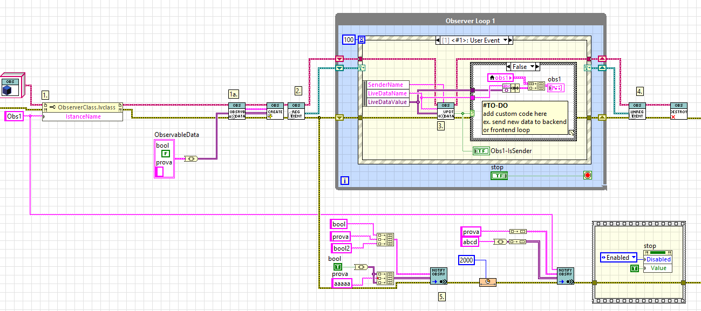

ObserverClass
Observer Class for LabVIEW
A lightweight, flexible implementation of the Observer Pattern designed for LabVIEW applications.
This class allows any number of observers to register to one or more observable data sources and get automatically updated whenever the data changes—promoting clean, modular, decoupled architecture.

✨ Features

Simple, class-based implementation of the classic Observer Pattern
Supports multiple observers registered to multiple observables
Automatic update propagation via the NotifyObserver method
Ideal for UI updates, modular architectures, plugin systems, data monitoring, and event‑driven applications

📦 Installation Requirements
To use this library, you need:
LabVIEW 2025 Q3

🔧 LabVIEW Composition Toolkit (PNR)
This library is required because it provides utilities to compose and decompose LabVIEW data types.
You can install it via VIPM:

Name: LabVIEW Composition Toolkit
Publisher: PNR
VIPM Page: https://www.vipm.io/package/pnr_lib_labview_composition/ [vipm.io]
Description: Provides functions to compose and decompose objects, clusters, maps, and sets in LabVIEW. Useful when interacting with class data structures. [vipm.io]

📁 Included Example
A full working example is included in the project: Example
This example demonstrates:
Two independent Observer instances
Each registered to its own observable data source
Automatic updates triggered through NotifyObserver

Perfect as a starting point to understand how to integrate the class into your own applications.

🚀 How to Use
Here’s a minimal usage workflow:

Create an Observer instance
Register it to one or more observable data points
Trigger an update using the NotifyObserver method
The observer receives data and executes its update logic

Example visual workflow:

🧩 Extending the Class
You can easily:

Override the Observer update method
Add custom observable types
Integrate the Observer class into plugin architectures or messaging systems
Chain multiple observables for complex update flows

📬 Support
If you'd like help integrating this into your project or creating more advanced architectural patterns, feel free to ask!